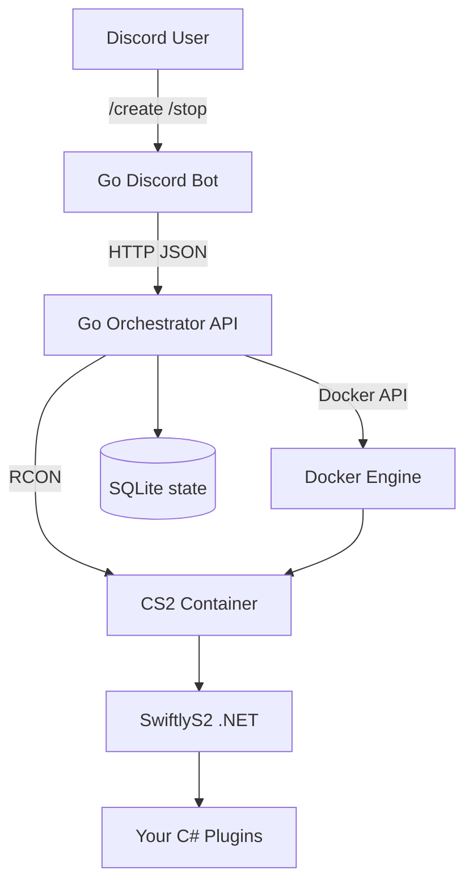

# cs2-server

On-demand **Counter-Strike 2** dedicated-server platform: a **Go** control plane
(Discord bot + orchestrator) spins up CS2 servers as Docker containers, each
running the **SwiftlyS2** framework so you can load **custom C# gameplay
plugins**. Public/private is configurable per server via a Steam GSLT.

Built Docker-first with a clean seam to migrate to **Kubernetes + Agones** later
(see `internal/orchestrator/agones_stub.go`).

> **Why SwiftlyS2 (not CounterStrikeSharp)?** CounterStrikeSharp is currently
> broken on recent CS2 builds — see the signature tracker at
> [ianlucas/cs2-signatures](https://github.com/ianlucas/cs2-signatures) (CSS is
> degraded/red, SwiftlyS2 is green). SwiftlyS2 is a Source2 C# scripting
> framework that loads directly via `gameinfo.gi` (it does **not** need Metamod),
> which also sidesteps Metamod's plugin-folder resolution issues on CS2.

## Architecture



- **Go control plane** — `cmd/orchestrator` (Docker lifecycle + RCON + HTTP API)
  and `cmd/bot` (Discord slash commands). Gameplay logic cannot be Go: CS2 loads
  native Source2 plugins, and the practical scripting layer is SwiftlyS2 (C#/.NET).
- **Game image** — `docker/cs2` extends `joedwards32/cs2`, installing SwiftlyS2
  and your compiled plugins on boot.

## Repository layout

```
docker/cs2/            Modded CS2 image (SwiftlyS2)
plugins/SamplePlugin/  Sample SwiftlyS2 C# plugin
cmd/orchestrator/      Orchestrator API service
cmd/bot/               Discord bot
internal/model/        Shared domain types (leaf package)
internal/orchestrator/ ServerManager interface + Docker backend
internal/store/        SQLite instance store
internal/ports/        UDP/TCP port allocator
internal/rcon/         Source RCON client + status parser
internal/api/          HTTP API
internal/apiclient/    HTTP client used by the bot
internal/bot/          Discord slash commands
internal/reaper/       Idle-server auto-shutdown
internal/config/       Env-based configuration
deploy/                Compose files, env examples, control-plane Dockerfiles
```

## Prerequisites

- Docker (engine + CLI) — that's it for deployment; Go and .NET are only used
  inside the compose build
- A Linux host with **60GB+ free disk** for the CS2 game files
- For public servers: a Steam **GSLT** (https://steamcommunity.com/dev/managegameservers)
- For local development on the Go/C# code: Go 1.26+ and the .NET 10 SDK

## Quick start

The entire stack runs in Docker Compose — `docker compose up -d --build` builds
the game image (with SwiftlyS2 + the bundled sample plugin), the orchestrator,
and (optionally) the Discord bot. No host-side builds, no host paths.

```bash
cp .env.example .env      # set CS2C_PUBLIC_IP, ports, optional Discord creds
docker compose up -d --build
```

This starts the **orchestrator** (API on `:${CS2C_API_PORT:-18080}`). Create a
server via the API:

```bash
curl -s -X POST http://127.0.0.1:18080/v1/servers \
  -H 'Content-Type: application/json' \
  -d '{"owner_id":"me","name":"test","map":"de_dust2","bot_quota":2}'
```

The first create downloads the game once (~40-60GB). With shared game files
enabled (default), later servers start in seconds. Connect in-game with the
returned `connect <ip>:<port>` string. The server console will show:

```
SwiftlyS2 | Loading plugin: (swRoot)/plugins/SamplePlugin/SamplePlugin.dll
[SamplePlugin] Loaded successfully.
SwiftlyS2 | Loaded Plugin SamplePlugin 0.1.0
```

In game, `!hello` in chat (or `sw_hello` in the server console) replies —
proving custom C# logic runs.

### Discord bot (optional)

Fill `DISCORD_TOKEN` + `DISCORD_APP_ID` in `.env`, then enable the `bot` profile:

```bash
docker compose --profile bot up -d --build
```

Then in Discord:

- `/create map:de_dust2 bots:4` → returns a `connect <ip>:<port>` string
- `/list`, `/status id:<id>`, `/restart id:<id>`, `/stop id:<id>`

## Deploying on a Linux VPS

Everything runs in Docker Compose — you only need **Docker** on the VPS. The Go
binaries, the C# plugin, and the game image are all built inside the compose
build (no Go/.NET install on the host).

```bash
# 1. Docker
curl -fsSL https://get.docker.com | sh
sudo usermod -aG docker "$USER" && newgrp docker

# 2. Clone + configure
git clone git@github.com:simonfalke-01/cs2-server.git && cd cs2-server
cp .env.example .env
#   set CS2C_PUBLIC_IP=<vps ip>; optionally DISCORD_TOKEN / DISCORD_APP_ID.
#   On rootless Docker, set DOCKER_SOCK=/run/user/$(id -u)/docker.sock

# 3. Build + run (orchestrator only; add --profile bot for the Discord bot)
docker compose up -d --build
```

**Firewall:** allow inbound **TCP 22** and **UDP 27015–27115** (your port pool).
Keep the orchestrator API (the published `CS2C_API_PORT`, default `18080`) and
RCON ports **closed to the Internet** — the API currently has no auth.

**Rootless Docker** is supported: the orchestrator's socket path is configurable
via `DOCKER_SOCK`, game containers reach the shared `cs2net` network by name, and
shared-files mode falls back to `fuse-overlayfs` when the kernel rejects an
unprivileged OverlayFS mount.

### Shared game files (OverlayFS) — save disk, start servers in seconds

By default each server stores its **own ~40–60GB game copy**. Enable shared mode
(the default in `.env.example`) to keep **one** read-only game copy that all
servers overlay with a tiny (~MB) writable layer:

```
CS2C_SHARED_GAME_FILES=true
```

- The first create runs a one-off **seeder** container that downloads the game
  once and bakes in SwiftlyS2 (slow, ~40GB). Subsequent servers start in
  **seconds** and cost only a few MB each.
- Requires a Linux host with OverlayFS or fuse-overlayfs (**not** Docker Desktop
  on macOS). Game containers get `CAP_SYS_ADMIN` + `/dev/fuse`; the entrypoint
  mounts the overlay as root then drops to the unprivileged `steam` user.
- Stopping a server removes its per-instance layer, reclaiming the space.

## How plugin loading works

SwiftlyS2 loads plugins from `game/csgo/addons/swiftlys2/plugins/<Name>/`.

The game image **bundles** the sample plugin: it's built in a `dotnet publish`
stage and copied to `/opt/cs2-plugins`. On boot, `docker/cs2/pre.sh`:

1. (non-shared mode) installs/refreshes SwiftlyS2 into `csgo/addons` and patches
   `csgo/gameinfo.gi` with the `Game csgo/addons/swiftlys2` search path;
2. syncs the bundled plugins from `/opt/cs2-plugins` into the SwiftlyS2 plugins
   dir, plus any extra plugins mounted at `/plugins`.

In shared mode, SwiftlyS2 + gameinfo are baked into the seeded read-only copy, so
boot only syncs the per-instance plugins.

### Writing your own plugin

Copy `plugins/SamplePlugin`, rename the project/class, and implement against the
[SwiftlyS2 API](https://swiftlys2.net/docs/). A plugin is a `BasePlugin`
subclass with a `[PluginMetadata]` attribute; build it with `dotnet publish`.
Keep the `SwiftlyS2.CS2` NuGet version in sync with the framework baked into the
image (both pinned to `1.3.5`). To bump:

- `plugins/*/.csproj` → `PackageReference Version`
- `docker/cs2/Dockerfile` → `SWIFTLY_VERSION` / `SWIFTLY_FILE`

Add more plugins by dropping new projects under `plugins/` — each is published
and bundled automatically by the image build.

## Configuration

All control-plane settings are environment variables; see
`deploy/controlplane.env.example` for the full list (ports window, default map,
idle-shutdown minutes, per-user limits, GSLT, Discord credentials).

Per-game-server settings (for the standalone smoke test) are in
`deploy/cs2.env.example`.

## Public vs private servers

- **Private/LAN**: leave `public` off (`/create public:false`). The container
  runs with `CS2_LAN=1` and needs no GSLT.
- **Public**: `/create public:true`. A GSLT is required — either pass one
  through (future enhancement) or set `CS2C_DEFAULT_GSLT` on the orchestrator.

## API reference (orchestrator)

| Method | Path                         | Purpose                  |
|--------|------------------------------|--------------------------|
| GET    | `/healthz`                   | health check             |
| POST   | `/v1/servers`                | create a server          |
| GET    | `/v1/servers?owner_id=`      | list servers             |
| GET    | `/v1/servers/{id}`           | get a server             |
| GET    | `/v1/servers/{id}/status`    | live status via RCON     |
| POST   | `/v1/servers/{id}/restart`   | restart                  |
| DELETE | `/v1/servers/{id}`           | stop + remove            |

## Development

```bash
make build    # build both binaries into ./bin
make test     # go test -race ./...
make vet      # go vet ./...
```

## Roadmap / migration to Kubernetes

The `ServerManager` interface (`internal/orchestrator/types.go`) is the single
seam between the control plane and the backend. Add an Agones-backed
implementation to scale across a cluster without touching the API or bot — see
`internal/orchestrator/agones_stub.go` for the plan.

## Credits

- [joedwards32/CS2](https://github.com/joedwards32/CS2) — base CS2 docker image
- [SwiftlyS2](https://github.com/swiftly-solution/swiftlys2) — Source2 C# framework
- [ianlucas/cs2-signatures](https://github.com/ianlucas/cs2-signatures) — framework compatibility tracker
