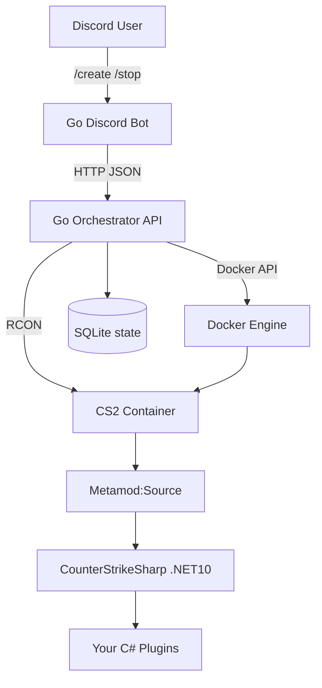

# cs2-server

On-demand **Counter-Strike 2** dedicated-server platform: a **Go** control plane
(Discord bot + orchestrator) spins up CS2 servers as Docker containers, each
running **Metamod:Source + CounterStrikeSharp** so you can load **custom C#
gameplay plugins**. Public/private is configurable per server via a Steam GSLT.

Built Docker-first with a clean seam to migrate to **Kubernetes + Agones** later
(see `internal/orchestrator/agones_stub.go`).

## Architecture



- **Go control plane** — `cmd/orchestrator` (Docker lifecycle + RCON + HTTP API)
  and `cmd/bot` (Discord slash commands). Gameplay logic cannot be Go: CS2 loads
  native Metamod plugins, and the practical scripting layer is CounterStrikeSharp
  (C#/.NET).
- **Game image** — `docker/cs2` extends `joedwards32/cs2`, installing Metamod +
  CounterStrikeSharp and your compiled plugins on boot.

## Repository layout

```
docker/cs2/            Modded CS2 image (Metamod + CounterStrikeSharp)
plugins/SamplePlugin/  Sample CounterStrikeSharp C# plugin
cmd/orchestrator/      Orchestrator API service
cmd/bot/               Discord bot
internal/model/        Shared domain types (leaf package)
internal/orchestrator/ ServerManager interface + Docker backend
internal/store/        SQLite instance store
internal/ports/        UDP/TCP port allocator
internal/rcon/         Source RCON client + status parser
internal/api/          HTTP API
internal/apiclient/    HTTP client used by the bot
internal/bot/          Discord slash commands
internal/reaper/       Idle-server auto-shutdown
internal/config/       Env-based configuration
deploy/                Compose files, env examples, control-plane Dockerfiles
```

## Prerequisites

- Docker (engine + CLI)
- Go 1.26+
- .NET 10 SDK (to build plugins)
- A Linux host with **60GB+ free disk** for the CS2 game files
- For public servers: a Steam **GSLT** (https://steamcommunity.com/dev/managegameservers)

## Quick start

### 1. Build the modded game image

```bash
make image          # docker build -t cs2-server/cs2:latest docker/cs2
```

### 2. Build the sample plugin

```bash
make plugins        # stages plugins-dist/SamplePlugin/SamplePlugin.dll
```

### 3. Smoke-test one server (no control plane)

```bash
cp deploy/cs2.env.example deploy/cs2.env   # edit RCON pw, GSLT, etc.
docker compose -f deploy/cs2-server.compose.yml --env-file deploy/cs2.env up
```

First boot downloads ~60GB via SteamCMD. Watch the console for:

- `meta list` showing **CounterStrikeSharp** loaded, and
- `SamplePlugin loaded successfully.`

In game, `!hello` in chat (or `css_hello` in the server console) replies, and
each round start prints a banner — proving custom C# logic runs.

### 4. Run the control plane

```bash
cp deploy/controlplane.env.example deploy/controlplane.env   # fill DISCORD_* etc.

# Easiest for local dev: run the orchestrator on the host so its bind-mount
# paths match the host Docker engine.
set -a; source deploy/controlplane.env; set +a
make run-orchestrator     # listens on :8080
make run-bot              # in another shell
```

Then in Discord:

- `/create map:de_dust2 bots:4` → returns a `connect <ip>:<port>` string
- `/list`, `/status id:<id>`, `/restart id:<id>`, `/stop id:<id>`

## Deploying on a Linux VPS (recommended)

Run **everything on the VPS** — game servers, orchestrator, and bot. The
orchestrator must share the host's Docker engine and filesystem (it passes host
paths to the Docker API and reaches RCON over `127.0.0.1`).

You only need **Docker** on the VPS; the Go binaries and the C# plugin are built
inside throwaway containers (no Go/.NET install required).

```bash
# 1. Docker
curl -fsSL https://get.docker.com | sh
sudo usermod -aG docker "$USER" && newgrp docker

# 2. Clone
git clone git@github.com:simonfalke-01/cs2-server.git && cd cs2-server

# 3. Build the modded game image
make image

# 4. Build the sample plugin (no .NET install)
docker run --rm -v "$PWD":/w -w /w/plugins/SamplePlugin mcr.microsoft.com/dotnet/sdk:10.0 \
  bash -c 'dotnet build -c Release && mkdir -p /w/plugins-dist/SamplePlugin \
           && cp bin/Release/net10.0/SamplePlugin.dll /w/plugins-dist/SamplePlugin/'

# 5. Build the Go binaries (no Go install)
docker run --rm -v "$PWD":/w -w /w -e CGO_ENABLED=0 golang:1.26 \
  bash -c 'go build -o bin/orchestrator ./cmd/orchestrator && go build -o bin/bot ./cmd/bot'

# 6. Configure
cp deploy/controlplane.env.example deploy/controlplane.env
#   set CS2C_PUBLIC_IP=<vps ip>, CS2C_PLUGINS_DIR / CS2C_DATA_ROOT to absolute
#   paths, DISCORD_TOKEN, DISCORD_APP_ID, CS2C_ORCHESTRATOR_URL=http://127.0.0.1:8080
#   and (recommended) CS2C_SHARED_GAME_FILES=true  (see below)

# 7. Run
set -a; source deploy/controlplane.env; set +a
./bin/orchestrator &     # or a systemd unit
./bin/bot &
```

**Firewall:** allow inbound **TCP 22** and **UDP 27015–27115** (your port pool).
Keep the orchestrator API (**TCP 8080**) and RCON ports **closed to the
Internet** — the API currently has no auth and RCON is reached via localhost.

### Shared game files (OverlayFS) — save disk, start servers in seconds

By default each server stores its **own ~40–60GB game copy**, so on an 80GB disk
you can only run one. Enable shared mode to keep **one** read-only game copy that
all servers overlay with a tiny (~MB) writable layer:

```
CS2C_SHARED_GAME_FILES=true
CS2C_SHARED_GAME_DIR=/absolute/path/to/data/shared
```

- The first `/create` runs a one-off **seeder** container that downloads the
  game once and bakes in Metamod + CounterStrikeSharp (slow, ~40GB). Subsequent
  servers start in **seconds** and cost only a few MB each.
- Requires a real Linux host with OverlayFS (**not** Docker Desktop on macOS).
  Game containers get `CAP_SYS_ADMIN` + `apparmor=unconfined` to mount the
  overlay; the entrypoint mounts as root then drops to the unprivileged `steam`
  user to run the server.
- Stopping a server removes its per-instance layer, reclaiming the space.

## How plugin loading works

CounterStrikeSharp loads plugins from
`game/csgo/addons/counterstrikesharp/plugins/<Name>/<Name>.dll`.

The orchestrator bind-mounts `CS2C_PLUGINS_DIR` (host) into each container at
`/plugins` (read-only). On boot, `docker/cs2/pre.sh`:

1. installs/refreshes Metamod + CounterStrikeSharp into `csgo/addons`,
2. idempotently patches `csgo/gameinfo.gi` to load Metamod,
3. copies every folder under `/plugins` into the CounterStrikeSharp plugins dir.

So staging `plugins-dist/SamplePlugin/SamplePlugin.dll` and pointing
`CS2C_PLUGINS_DIR=./plugins-dist` is all that's needed to ship a plugin.

### Writing your own plugin

Copy `plugins/SamplePlugin`, rename the project/class, and implement against the
[CounterStrikeSharp API](https://docs.cssharp.dev/). Keep the
`CounterStrikeSharp.API` NuGet version in sync with the CSS runtime baked into
the image (both pinned to `1.0.369`, .NET 10). To bump:

- `plugins/*/.csproj` → `PackageReference Version`
- `docker/cs2/Dockerfile` → `CSS_VERSION` / `CSS_FILE`

## Configuration

All control-plane settings are environment variables; see
`deploy/controlplane.env.example` for the full list (ports window, default map,
idle-shutdown minutes, per-user limits, GSLT, Discord credentials).

Per-game-server settings (for the standalone smoke test) are in
`deploy/cs2.env.example`.

## Public vs private servers

- **Private/LAN**: leave `public` off (`/create public:false`). The container
  runs with `CS2_LAN=1` and needs no GSLT.
- **Public**: `/create public:true`. A GSLT is required — either pass one
  through (future enhancement) or set `CS2C_DEFAULT_GSLT` on the orchestrator.

## API reference (orchestrator)

| Method | Path                         | Purpose                  |
|--------|------------------------------|--------------------------|
| GET    | `/healthz`                   | health check             |
| POST   | `/v1/servers`                | create a server          |
| GET    | `/v1/servers?owner_id=`      | list servers             |
| GET    | `/v1/servers/{id}`           | get a server             |
| GET    | `/v1/servers/{id}/status`    | live status via RCON     |
| POST   | `/v1/servers/{id}/restart`   | restart                  |
| DELETE | `/v1/servers/{id}`           | stop + remove            |

## Development

```bash
make build    # build both binaries into ./bin
make test     # go test -race ./...
make vet      # go vet ./...
```

## Roadmap / migration to Kubernetes

The `ServerManager` interface (`internal/orchestrator/types.go`) is the single
seam between the control plane and the backend. Add an Agones-backed
implementation to scale across a cluster without touching the API or bot — see
`internal/orchestrator/agones_stub.go` for the plan.

## Credits

- [joedwards32/CS2](https://github.com/joedwards32/CS2) — base CS2 docker image
- [Metamod:Source](https://www.sourcemm.net/)
- [CounterStrikeSharp](https://github.com/roflmuffin/CounterStrikeSharp)
